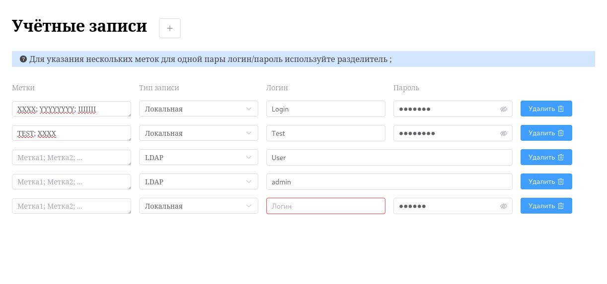

# Менеджер учётных записей



Данный проект — тестовое задание на вакансию в компанию [**SaaSoft**](https://saasoft.ru/).  
Это приложение для управления списком учётных записей с поддержкой локальных и LDAP-аккаунтов, реализованное на Vue3 + TypeScript + Pinia + Element Plus.

## Возможности

- Добавление, редактирование и удаление учётных записей
- Поддержка типов аккаунтов: Локальная и LDAP
- Валидация обязательных полей (логин, пароль)
- Валидация длины меток (максимум 50 символов на каждую из меток)
- Метки вводятся через `;` и преобразуются в массив объектов
- Пароль скрывается для LDAP-аккаунтов и сохраняется как `null`
- Все данные сохраняются в localStorage и отображаются после перезагрузки

## Стек

- **Vue.js 3** (Composition API)
- **TypeScript**
- **Pinia** (стейт-менеджер)
- **Element Plus** (UI фреймворк)

## Запуск

```sh
npm install
npm run dev
```

## Структура

- [`App.vue`](/src/App.vue) — главный компонент, список аккаунтов, кнопка добавления
- [`Account.vue`](/src/components/Account.vue) — компонент одной учётной записи
- [`accountStore.ts`](/src/stores/accountStore.ts) — Pinia для управления аккаунтами
- [`types.ts`](/src/types.ts) — типы данных